### Hello, 我是小帅! 👋

<code></code>
<code></code>
<code></code>
<code></code>
<code></code>

[](https://juejin.cn/user/1204720476890477)
[](https://js-banana.github.io/blog)
[](https://cdn.jsdelivr.net/gh/JS-banana/images/vuepress/1.jpg)

<!-- :sunny: I'm currently learning and working on... -->

<!-- :fire: To live alone is the fate of all great souls

:raised_hand: 掘金：[https://juejin.cn/user/1204720476890477](https://juejin.cn/user/1204720476890477)

:sparkles: 博客：[https://ssscode.com/](https://ssscode.com/) -->

<!-- **Languages and Tools:**   -->

<!--  -->

<!-- [](https://github.com/anuraghazra/github-readme-stats) -->

<table width="800px">
<tr>
<td valign="top" width="50%">

#### 🏊‍♂️ <a href="https://gist.github.com/JS-banana/b4b79e0deb0164edaae772ecbc5bd8bc" target="_blank">Weekly Development Breakdown</a>

<!-- code_time starts -->

```text
TypeScript 10 hrs 51 mins ████████████▍░░░░░░░░  59.1%
Other      5 hrs 45 mins  ██████▌░░░░░░░░░░░░░░  31.3%
JSON       48 mins        ▉░░░░░░░░░░░░░░░░░░░░   4.4%
Markdown   34 mins        ▋░░░░░░░░░░░░░░░░░░░░   3.1%
Less       9 mins         ▏░░░░░░░░░░░░░░░░░░░░   0.8%
```

<!-- code_time ends -->
</td>

<td valign="top" width="50%">

#### 🤹‍♀️ <a href="https://ssscode.com/" target="_blank">Recent Blog</a>

<!-- blog starts -->
* <a href='https://blog.laifuyou.com/posts/2026/tauri-to-electron-ai-chat-backup/' target='_blank' title='我做了两个工具，一个 7MB 的壳，一个会记住的壳'>我做了两个工具，一个 7MB 的壳，...</a> - 
* <a href='https://blog.laifuyou.com/posts/2026/openclaw-vs-claude-code-differences/' target='_blank' title='你问我 OpenClaw 和 Claude Code 有什么区别'>你问我 OpenClaw 和 Cla...</a> - 
* <a href='https://blog.laifuyou.com/posts/2026/ai-writing-code-developer-meaning/' target='_blank' title='同事问我你代码都让 AI 写那我们开发的意义是什么呢？'>同事问我你代码都让 AI 写那我们开...</a> - Mon, 09 Mar 2026 00:00:00 GM
<!-- blog ends -->

</td>
</tr>

</table>

<p>
  
  
</p>

<!-- [](https://github.com/anuraghazra/github-readme-stats) -->

<!--  -->


